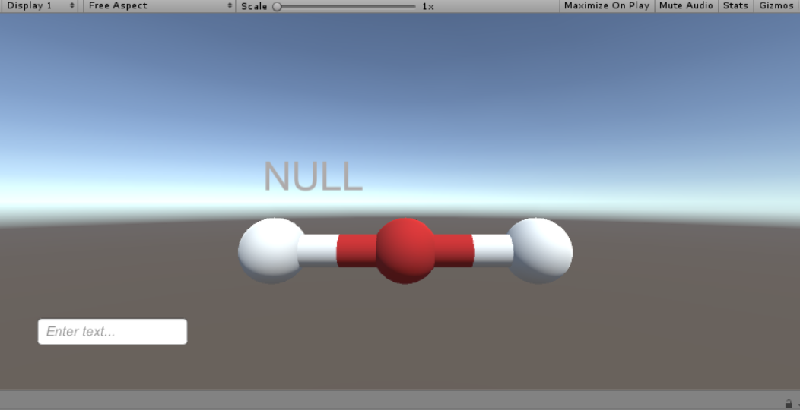
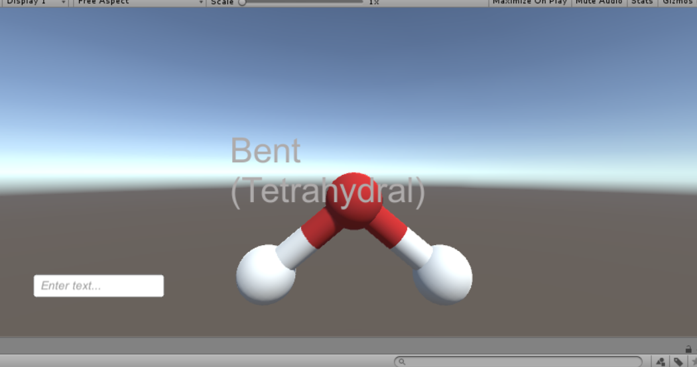
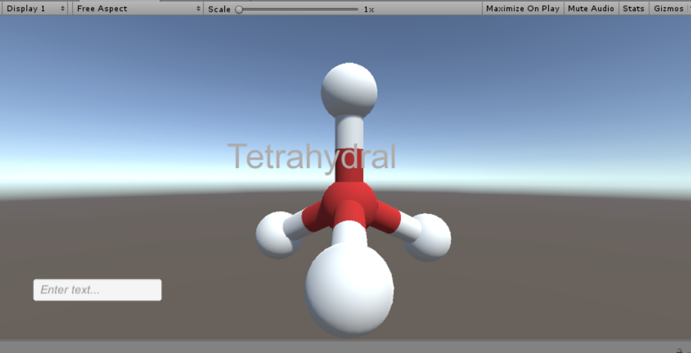
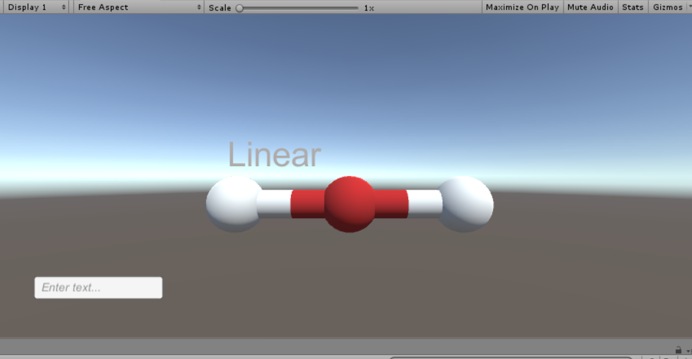
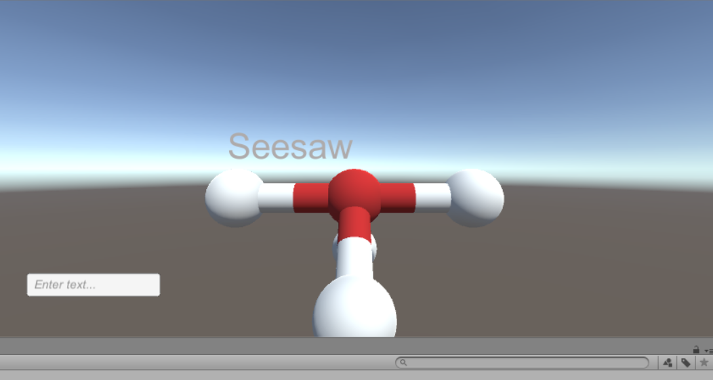

# Molecular-Chemistry-Visualization
A Unity program to identify the VSPER shape of a molecular compound

This project uses a custom C++ backend library to identify the shapes of the molecules and a Unity C# frontend to display the appropriate shape

Error Screen

Example Molecule: H2O, Shape: Bent

Example Molecule: CH4, Shape: Tetrahydral

Example Molecule: CO2, Shape: Linear

Example Molecule: SF4, Shape: Seesaw

